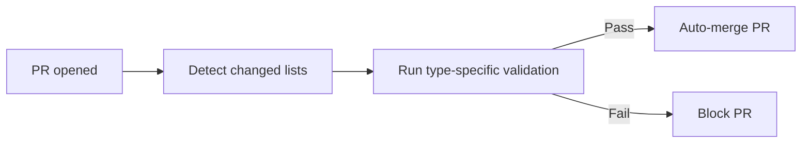
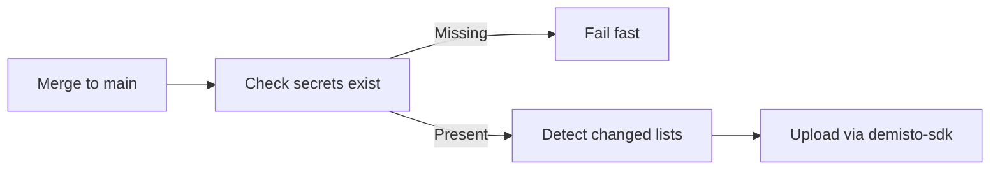

# XSOAR/XSIAM List Management CI/CD

## Overview

Proof of concept for managing XSOAR/XSIAM lists via Git with automated CI/CD. Lists are stored as file pairs (metadata YAML + raw data file) and validated/deployed through GitHub Actions.

## Problem

Managing lists in XSOAR/XSIAM manually through the UI doesn't scale well. Changes aren't tracked, there's no review process, and deployments are manual.

## Solution

Git-based workflow where lists are version controlled and CI/CD handles validation and deployment automatically.

### List Structure

Each list is a directory under `Lists/` containing two files:

- **`metadata.yml`** — defines the list id, name, type, and description
- **`data.<ext>`** — the raw list content (`.json`, `.csv`, or `.txt`)

```yaml
# Example metadata.yml
id: blocked-ips
name: Blocked IPs
type: json
description: List of IPs to block at the firewall.
```

### Supported List Types

| Type | Validation | Data File |
|---|---|---|
| `json` | Parses and validates JSON syntax | `data.json` |
| `csv` | Validates CSV structure and consistent column counts | `data.csv` |
| `custom` | Runs a Python script for validation | `data.txt` or any |

### Custom Validators

Custom validators live in `scripts/custom_validators/`. The system checks for `<list-directory-name>.py` first, then falls back to `default.py`. Each validator receives the data file path as an argument and exits 0 for pass, non-zero for fail.

## CI/CD Pipeline

### PR Validation (`validate-pr.yml`)



- Triggers on PRs to `main` touching `Lists/**`
- Only validates lists that actually changed
- Auto-merges via squash if all validations pass

### Deployment (`deploy-lists.yml`)



- Triggers on push to `main` touching `Lists/**`
- Checks for required secrets before doing any setup (saves Actions minutes)
- Uploads only changed lists using `demisto-sdk`

### Required Secrets

| Secret | Purpose |
|---|---|
| `DEMISTO_BASE_URL` | XSOAR/XSIAM server URL |
| `DEMISTO_API_KEY` | API key for authentication |
| `XSIAM_AUTH_ID` | Auth ID for XSIAM |

## Workflow for Adding a List

1. Create `Lists/<list-name>/metadata.yml` with type and description
2. Add the data file (`data.json`, `data.csv`, etc.)
3. Open a PR to `main`
4. CI validates automatically
5. PR auto-merges on success
6. Deploy workflow uploads the list to XSOAR/XSIAM

## Dependencies

- **Python 3.12**
- **PyYAML** — parsing metadata files
- **demisto-sdk >=1.38.21** — uploading lists to XSOAR/XSIAM

## Status

> [!info] Proof of Concept
> This is a PoC. Not yet deployed to production.

## Tags

#xsoar #xsiam #cicd #automation #poc
